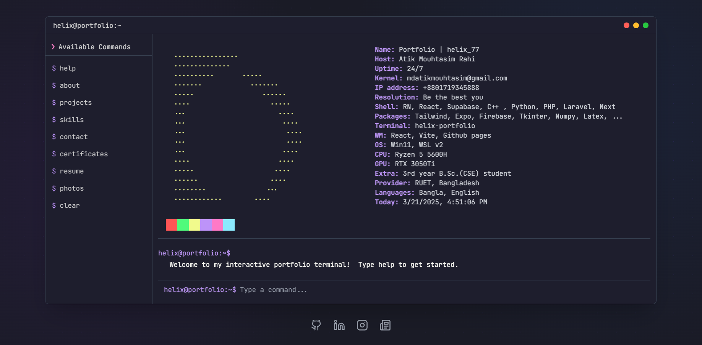

# Helix Terminal Portfolio (work-in-progress)




A sleek, interactive terminal-style website built with React and TypeScript, designed to showcases personal details, skills, and tools through an elegant, modern UI with a focus on usability and aesthetics.

## 🚀 Features

- Fully interactive terminal experience
- Command suggestions with auto-complete
- Responsive design for all devices
- Sections for projects, skills, contact, resume and more
- Keyboard navigation support
- Visual command list sidebar

## 🧰 Tech Stack

- React
- TypeScript
- Tailwind CSS
- Ai(lovable.dev, claude, grok)

## 📋 Available Commands

| Command | Description |
|---------|-------------|
| `help` | Display available commands |
| `about` | View information about me |
| `projects` | Browse project portfolio |
| `skills` | Display skills and expertise |
| `contact` | Show contact information |
| `certificates` | View certificates and achievements |
| `resume` | Display resume |
| `photos` | Browse photo gallery |
| `clear` | Clear the terminal |
| `theme` | Toggle dark/light theme |

## 🛠️ Setup & Installation

1. Clone the repository:
   ```
   git clone https://github.com/helix-77/terminal-portfolio-dreamscape.git
   ```

2. Navigate to the project directory:
   ```
   cd terminal-portfolio-dreamscape
   ```

3. Install dependencies:
   ```
   npm install
   ```

4. Start the development server:
   ```
   npm run dev
   ```

5. Build for production:
   ```
   npm run build
   ```

## 🎯 How to Customize

1. **Profile Data**: Edit the data files in `src/` to personalize your information
2. **Theme**: Modify color themes in the Tailwind config file
3. **Commands**: Add or remove commands in `useTerminalCommands.ts`


## 🔍 Keyboard Shortcuts

- `Tab`: Auto-complete command
- `Enter`: Execute command
- `Up/Down`: Navigate command history
- `Ctrl+Enter`: Execute selected command from left sidepanel
- `Esc`: Close suggestions


## 🙏 Credits

- [React](https://reactjs.org/)
- [TypeScript](https://www.typescriptlang.org/)
- [Tailwind CSS](https://tailwindcss.com/)
- [Lovable.dev](https://lovable.dev)

## 🤝 Contributing

Contributions, issues, and feature requests are welcome! Feel free to check the [issues page](https://github.com/yourusername/terminal-portfolio/issues).
